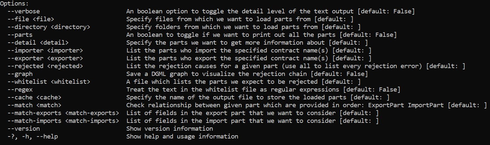
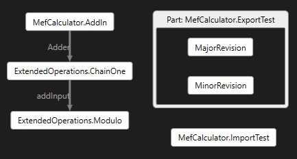
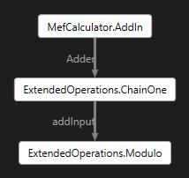
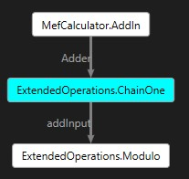

# VSMefx
A Composition Analysis Tool for VS-MEF

## Command Options Summary



## Part Information Getter 

The following command illustrates the basic functionality to get information about parts and thier dependencies: 
```
--parts --detail MefCalculator.ImportTest --exporter MefCalculator.MefCalculatorInterfaces+IOperation --importer ExtendedOperations.ChainOne --file MefCalculator.dll --directory Extensions
```

This command performs a variety of different operations and thus we will break down the command by the specified options to understand
its functionality. We specify that we want to perform analysis on the MefCalculator.dll file as well as the Extensions folder through ` --files MefCalculator.dll --directory Extensions`. When a folder is specified, Mefx automatically finds all valid files present in the folder itself along with its subfolders. 

Currently, Mefx considers any file with the extensions .dll, .exe, or .cache as valid files. Please note that the .cache file must have been created using the SaveAsync of the Cached Catalog in the main MEF library for Mefx to be able to properly process the file. Mefx allows users to store the catalog created from the files specified in the input argument by specifiying the output file name in the `--cache` option and thus can be called by including something like `--cache Combined.cache` in the command. 

The `--parts` option of the commands tells Mefx to list all the parts present in the input files and folders. The `--detail` argument allows us to get more information on a particular part(s) by printing out all the imports and exports associated with the specified part name. 

The `--exporter` option can be used to find the exporters of a given contract name like `--exporter MefCalculator.MefCalculatorInterfaces+IOperation` finds all exports with the contract name of IOperation. Finally, the `--importer` option can be used to find the parts that contains imports with a given contract name like `--importer ExtendedOperations.ChainOne` finds all the parts that contain a import with contract name of ExtendedOperations.ChainOne. 

The above commands gives us the following output which shows the workings of all the features above: 
```
Parts in Catalog are
MefCalculator.AddIn
MefCalculator.ExportMeta
MefCalculator.ExportTest
MefCalculator.ImportTest
MefCalculator.MefCalculatorInterfaces+Add
MefCalculator.MefCalculatorInterfaces+Subtract
ExtendedOperations.ChainOne
ExtendedOperations.Modulo

Printing out details for part MefCalculator.ImportTest
[Export] MefCalculator.ImportTest
[Import] Field: Operations, Contract Name: MefCalculator.MefCalculatorInterfaces+IOperation
[Import] Field: failingField, Contract Name: MissingField
[Import] Field: IntInput, Contract Name: MetadataTest

Exporting parts for MefCalculator.MefCalculatorInterfaces+IOperation:
MefCalculator.MefCalculatorInterfaces+Add
MefCalculator.MefCalculatorInterfaces+Subtract
ExtendedOperations.Modulo

Importing parts for ExtendedOperations.ChainOne:
ExtendedOperations.Modulo
```

## General Rejection Information

The following command showcases the ability of Mefx to share rejection information for all the input files and folders: 

```
--graph . --rejected all  --file MefCalculator.dll --directory Extensions
```

The main things that we want to focus on in this section are the `--graph` and the `--rejected all` sections of the command. The `--rejected all` tells Mefx that we want information about all the rejections, and in the next example we will see how we can get rejection information about particular parts. The `--graph` option tells Mefx to generate a [DGML file](https://docs.microsoft.com/en-us/visualstudio/modeling/directed-graph-markup-language-dgml-reference?view=vs-2019) to visualize the rejection graph and see which imports and parts are causing issues. A path, either relative or absolute, needs to be specified to the graph command to indicate which folder to save the rejection graph in. If an invalid path is specified, then Mefx automatically saves the rejection graph in the current working directory.

The output of running the above command looks like: 
```
Listing all the rejection issues
Errors in level 3
ExtendedOperations.Modulo

Errors in level 2
ExtendedOperations.ChainOne

Errors in level 1
MefCalculator.ExportTest
MefCalculator.ImportTest
MefCalculator.AddIn

Saved rejection graph to <Path to Output Folder>\AllErrors.dgml
```

Mefx classify parts that have import issues into different levels based on the cause of thier import issues. Parts on higher levels, i.e. parts with larger level numbers, generally tend to have rejection issues because of the fact that they are importing a part that has failed imports itself, which means that the part they are trying to import will have a lower level number. 

Another way of saying the above statement is that rejections in higher levels tend to be caused by issues in a lower level. Thus we can examine the **root causes** of our failed rejections by looking at issues at the lowest level since the issues at that level are guaranteed to not because of a part that they are importing. 

The saved DGML file has the parts that have import issues as the nodes and has directed edges between parts to indicate the flow of part imports. Since we only store the nodes that have rejection issues, any incoming edges into a node can be interpreted as parts that are causing it to be rejected and any outgoing edges in a node can be thought of as parts that it is causing a rejection issues in. 

If a part has exports other than itself, then Mefx visualizes that part as a container and stores the other exports inside the given container. 

The DGML diagram that is saved when we run the above command looks like 


To help the users, quickly diagonse import errors, the edges in the DGML diagram are labeled with the field name in the importing part, i.e. the part at the head of the directed edge. For example, we can quickly derive from the above diagram that the import issue with ExtendedOperations.ChainOne in ExtendedOperations.Modulo is associated with the field addInput in Modulo.   

## Specific Rejection Information 

When working with large projects and libraries with tons of .dll and .exe files, it will get painful to list/visualize a graph for all the import issues when we care about a single or only a couple of parts. Thus, Mefx allows users to indicate which part(s) they want to trace the rejection information about through commands such as: 
```
--verbose --graph . --rejected ExtendedOperations.Modulo  --file MefCalculator.dll --directory Extensions
```

When a user specifies a part to get rejection information about, Mefx automatically finds parts whose import issues impact the specified part. Thus, when displaying information or generating a graph, Mefx only presents import issues that impact the specified part, both directly and indirectly, and ignores all others. The `--verbose` command can be used to print out additional information about the issues and the parts involved. 

The output of the above command is: 
```
Printing Rejection Graph Info for ExtendedOperations.Modulo

Errors in Level 3
ExtendedOperations.Modulo.addInput: expected exactly 1 export matching constraints:
    Contract name: ExtendedOperations.ChainOne
    TypeIdentityName: ExtendedOperations.ChainOne
but found 0.

Errors in Level 2
ExtendedOperations.ChainOne.Adder: expected exactly 1 export matching constraints:
    Contract name: MefCalculator.AddIn
    TypeIdentityName: MefCalculator.AddIn
but found 0.

Errors in Level 1
MefCalculator.AddIn.fieldOne: expected exactly 1 export matching constraints:
    Contract name: ChainOne
    TypeIdentityName: System.String
but found 0.

Saved rejection graph to <Path to Output Folder>\ExtendedOperations_Modulo.dgml
```

Comparing this output to the previous output, we see that Mefx automatically filtered out the rejections to only include those that affect the ExtendedOperations.Modulo part. Since the verbose option was chosen, Mefx prints out detailed information about the cause of the issue which can be used to quickly pinpoint and resolve the issue. We can see this filtering take place in the output DGML file as well, which now looks like: 



## Whitelisting

The whitelist options allows you to a specify a text file that lists parts that are expected to be rejected. For example, let us say that we have a file named expected.txt which contains the text "ExtendedOperations.ChainOne" and we run the command from above with this as the whitelist: 

```
--verbose --graph . --rejected ExtendedOperations.Modulo  --file MefCalculator.dll --directory Extensions --whitelist expected.txt
```

Currently, all Mefx does with the whitelist file is indicated to the user which parts have been whitelisted in both the textual and visual outputs. Rather than automatically removing parts which may introduce additional confusion, Mefx instead tries to make it to clear the user which parts have been whitelisted and let them decide how to best go about fixing this error with the above information in mind. 

Thus, the output of the above command is: 
```
Printing Rejection Graph Info for ExtendedOperations.Modulo

Errors in Level 3
ExtendedOperations.Modulo.addInput: expected exactly 1 export matching constraints:
    Contract name: ExtendedOperations.ChainOne
    TypeIdentityName: ExtendedOperations.ChainOne
but found 0.

Errors in Level 2
[Whitelisted] ExtendedOperations.ChainOne.Adder: expected exactly 1 export matching constraints:
    Contract name: MefCalculator.AddIn
    TypeIdentityName: MefCalculator.AddIn
but found 0.

Errors in Level 1
MefCalculator.AddIn.fieldOne: expected exactly 1 export matching constraints:
    Contract name: ChainOne
    TypeIdentityName: System.String
but found 0.

Saved rejection graph to <Path to Output Folder>\ExtendedOperations_Modulo.dgml
```

Additionally, Mefx also allows the user to treat the lines in the whitelist files as regular expression through the `--regex` option. For example, if we wanted to whitelist all the parts from the ExtendedOperations project, we could modify the line in expected.txt to contain the line "ExtendedOperations\\..*" and include the `--regex` option in our command.

In the DGML file, Mefx indicates which parts have been whitelisted by changing the color of the nodes associated with the whitelisted parts to blue which easily allows users to distinigiush between whitelisted parts and non whitelisted parts. Thus, the DGML file produced by the above command looks like:




## General Matching

The match option provides users an option to easily check the import/export relationship between two given parts and analyze causes of import failures between them. This feature is especially useful when paired with the rejection options as it provides specific information about how the import and export of the specified parts relate and why the exports fail to satisfy the import requirements. For example, the following command indicates how to properly use the match feature:

```
--match MefCalculator.ExportMeta MefCalculator.ImportTest --file MefCalculator.dll --directory Extensions
```

Mefx analyzes the pairs from left to right and thus it interprets the above command as try to match the exports of MefCalculator.ExportMeta with the imports of MefCalculator.ImportTest. In general specify parts to the match command in the following order: `ExportPartName ImportPartName`

The output of the above command is:

```
Finding matches from MefCalculator.ExportMeta to MefCalculator.ImportTest

Found potential match(es) for importing field IntInput
Considering exporting field ExportOne
Export matches all import constraints
Considering exporting field ExportTwo
Failed Constraint #1
Expected: [Type - System.Int32], Found: [Type - System.String]
1/2 export(s) satisfy the import constraints
```

Let us analyze this output to understand how the match functionality works. In general matching, Mefx performs the detailed match check between a pair of imports and exports only in they first match on contract name. If there is more than one export in the specified part that matches the importing contract name, then Mefx matches all of them against the import requirements individually. In the example above, the exporting fields ExportOne and ExportTwo both match the contract name for the importing field IntInput and thus the program considers both of them seperately. It then reports back to the user either that the export meets the import requirements or the reason why the export failed to meet the import requirements. Going back to the example, we see that the exporting field ExportOne meets all the import requirements but ExportTwo failes to meet the requirement that the exporting type be of System.Int32. 

## Specific Matching

Mefx includes two other options in order to filter the fields that matching in performed on in `--match-exports` and the `--match-imports`. The arguments should be field names in the exporting part, for match-exports, and field names in the importing part, for the match-imports, that you want to consider, and ignore all others. More specifically, Mefx tries to match every field in the match-imports with every possible field in match-export and thus if you specify 2 fields in match-import and 3 fields in match-export then Mefx performs 6 total matches. 

If the exporting part is exporting itself and you want to specify to perform matching using it, pass in the name of the part into the match-exports argument. Additionally, if you only specify one of the above filtering option then Mefx automatically pairs those fields with all the fields in the coressponding part. For example, if you specify one field name in match-export and don't include the match-import option then Mefx tries to match that exporting field with every field in the importing part. 

We will illustrate the above functionality and the different cases by including a couple of example commands and what thier output looks like.


### Specify both exporting and importing fields

Command:
```
--match MefCalculator.ExportMeta MefCalculator.ImportTest --match-exports ExportOne ExportTwo --match-imports IntInput --file MefCalculator.dll --directory Extensions
```

Output:
```
Finding matches from MefCalculator.ExportMeta to MefCalculator.ImportTest

Performing matching for importing field IntInput
Considering exporting field ExportOne
Export matches all import constraints
Considering exporting field ExportTwo
Failed Constraint #1
Expected: [Type - System.Int32], Found: [Type - System.String]
1/2 export(s) satisfy the import constraints
```

### Specify only exporting field

Command:
```
--match MefCalculator.ExportMeta MefCalculator.ImportTest --match-exports MefCalculator.ExportMeta --file MefCalculator.dll --directory Extensions
```

Output:
```
Finding matches from MefCalculator.ExportMeta to MefCalculator.ImportTest

Performing matching for importing field IntInput
Considering exporting field MefCalculator.ExportMeta
Failed Constraint #1
Expected: [Contract Name - MetadataTest], Found: [Contract Name - MefCalculator.ExportMeta]
Failed Constraint #2
Expected: [Type - System.Int32], Found: [Type - MefCalculator.ExportMeta]

Performing matching for importing field failingField
Considering exporting field MefCalculator.ExportMeta
Failed Constraint #1
Expected: [Contract Name - MissingField], Found: [Contract Name - MefCalculator.ExportMeta]
Failed Constraint #2
Expected: [Type - System.String], Found: [Type - MefCalculator.ExportMeta]

Performing matching for importing field Operations
Considering exporting field MefCalculator.ExportMeta
Failed Constraint #1
Expected: [Contract Name - MefCalculator.MefCalculatorInterfaces+IOperation], Found: [Contract Name - MefCalculator.ExportMeta]
Failed Constraint #2
Expected: [Type - MefCalculator.MefCalculatorInterfaces+IOperation], Found: [Type - MefCalculator.ExportMeta]
```

### Specify only importing field

Command:
```
--match MefCalculator.ExportMeta MefCalculator.ImportTest --match-imports IntInput --file MefCalculator.dll --directory Extensions
```

Output:
```
Finding matches from MefCalculator.ExportMeta to MefCalculator.ImportTest

Performing matching for importing field IntInput
Considering exporting field MefCalculator.ExportMeta
Failed Constraint #1
Expected: [Contract Name - MetadataTest], Found: [Contract Name - MefCalculator.ExportMeta]
Failed Constraint #2
Expected: [Type - System.Int32], Found: [Type - MefCalculator.ExportMeta]
Considering exporting field ExportOne
Export matches all import constraints
Considering exporting field ExportTwo
Failed Constraint #1
Expected: [Type - System.Int32], Found: [Type - System.String]
1/3 export(s) satisfy the import constraints
```